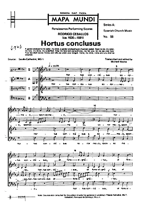

_Hortus Conclusus_ is a motet by Spanish renaissance composer Rodrigo de Ceballos (ca 1530-1581)

The motet is set to a text from the [Song of Songs](http://en.wikipedia.org/wiki/Song_of_Songs):

> _Hortus conclusus soror mea, sponsa mea, hortus conclusus et fons signatus. Aperi mihi, o soror mea, amica mea, columba mea, immaculata mea. Surge propera amica mea, et veni._
>
> _Veni, speciosa mea, ostende mihi faciem tuam. Favus distilans labia tua, mel et lac sub lingua tua. Veni sponsa mea, veni coronaberis._

Translation:

> A garden enclosed is my sister, my bride, a garden enclosed and a fountain sealed. Open to me, my sister, my love, my dove, my undefiled. Arise my love and come.
>
> Come, my fair one, let me see your face. Your lips distil nectar, honey and milk are under your tongue. Come, my bride, come and you shall be crowned.

