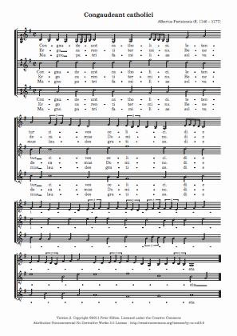

_Congaudeant Catholici_ is the only surviving work by Albertus Parisiensis.

> The piece was part of the Codex Calixtinus, a work intended as a guide for travelers making the Way of St. James, a pilgrimage to a shrine in Santiago de Compostela.

([Wikipedia](http://en.wikipedia.org/wiki/Albertus_Parisiensis))